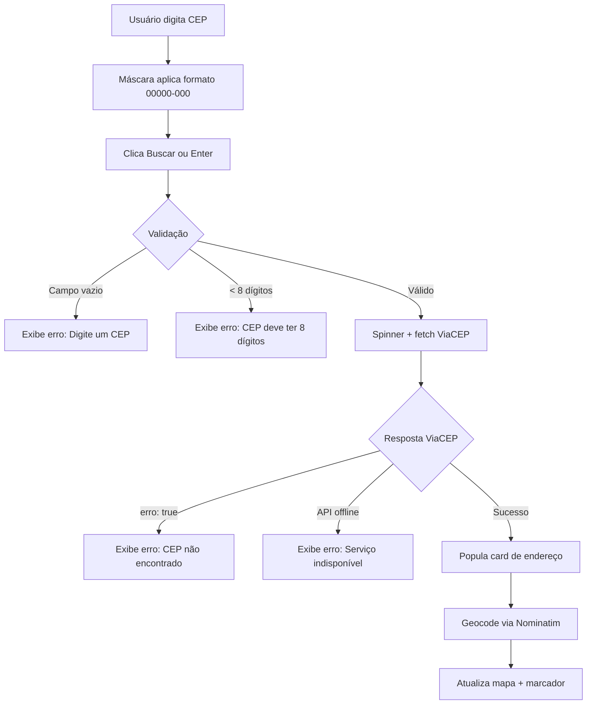

# Busca CEP — Aplicação Web

Criar uma aplicação single-page (HTML + CSS + JS puro) que permite ao usuário digitar um CEP brasileiro, consultar a API ViaCEP, exibir os dados completos do endereço e mostrar a localização aproximada em um mapa interativo via Leaflet/OpenStreetMap.

## Decisões de Design

### Stack Tecnológica
- **HTML + CSS + JavaScript puro** — sem framework, sem bundler, sem backend.
- **ViaCEP** (`https://viacep.com.br/ws/{cep}/json/`) para consulta de endereço.
- **Nominatim / OpenStreetMap** (`https://nominatim.openstreetmap.org/search`) para geocodificação (endereço → coordenadas).
- **Leaflet.js 1.9.4** (CDN) + tiles OpenStreetMap para exibição do mapa e marcador.

### Estilo Visual
- Dark mode como padrão com gradientes sutis e efeitos de **glassmorphism**.
- Tipografia moderna via **Google Fonts (Inter)**.
- Micro-animações em hover, focus e transições de estado.
- Paleta de cores com tons de azul/roxo vibrante sobre fundo escuro.
- Layout responsivo com CSS Grid/Flexbox — mobile-first.

---

## Proposed Changes

### Estrutura de Arquivos

```
06_Busca CEP/
├── index.html       ← Página principal (estrutura semântica, Leaflet CDN, Google Fonts)
├── styles.css       ← Design system completo (dark mode, glassmorphism, animações)
└── app.js           ← Lógica da aplicação (estado, API, mapa, validações)
```

---

### [NEW] [index.html](file:///Users/macbook-brunnonovaes/Documents/Antigravity%20OS/06_Busca%20CEP/index.html)

Página principal contendo:

- **`<head>`**: meta tags SEO (title, description, viewport), Google Fonts (Inter), Leaflet CSS/JS via CDN, link para `styles.css`.
- **Header**: título da aplicação com ícone/logo SVG inline e subtítulo.
- **Seção de busca**:
  - `<input id="cep-input">` com placeholder "00000-000", `maxlength="9"`, `inputmode="numeric"`.
  - Botão "Buscar" (`id="btn-search"`) com ícone de lupa SVG.
  - Botão/ícone "Limpar" (`id="btn-clear"`) com ícone de X.
- **Área de feedback**: `<div id="loading-spinner">` (spinner CSS), `<div id="error-message">` para mensagens de erro.
- **Card de dados** (`id="address-card"`): grid com labels e valores para CEP, Logradouro, Bairro, Cidade, Estado, DDD e Código IBGE.
- **Card de mapa** (`id="map-card"`): contém `<div id="map">` com altura fixa para o Leaflet.
- **Footer**: créditos e atribuição OpenStreetMap.
- `<script src="app.js">` no final do body.

---

### [NEW] [styles.css](file:///Users/macbook-brunnonovaes/Documents/Antigravity%20OS/06_Busca%20CEP/styles.css)

Design system completo:

#### Variáveis CSS (`:root`)
```
--bg-primary: #0a0a1a        (fundo principal escuro)
--bg-card: rgba(255,255,255,0.05)  (glassmorphism)
--accent: #6366f1             (roxo/indigo vibrante)
--accent-hover: #818cf8
--text-primary: #f1f5f9
--text-secondary: #94a3b8
--border-glass: rgba(255,255,255,0.1)
--error: #ef4444
--success: #22c55e
--radius: 16px
--shadow-glow: 0 0 30px rgba(99,102,241,0.15)
```

#### Componentes
- **Reset/Base**: box-sizing, font-family Inter, scroll-behavior smooth.
- **Body**: gradiente radial escuro, min-height 100vh.
- **Header**: texto centralizado com gradiente de texto animado.
- **Search bar**: container glass com backdrop-filter blur, border radius grande, sombra glow no focus.
- **Input CEP**: estilo limpo, borda inferior animada, transição de cor no focus.
- **Botões**: gradiente accent com hover scale + glow, ícone limpar com hover rotate.
- **Loading spinner**: animação CSS `@keyframes spin`, centralizado.
- **Error message**: badge vermelho com ícone, animação slide-in.
- **Address card**: grid glass com 2 colunas (desktop) / 1 coluna (mobile), cada item com label + valor, animação fade-in escalonada via `animation-delay`.
- **Map card**: glass container, border-radius com overflow hidden para o mapa, sombra.
- **Responsividade**: `@media (max-width: 768px)` para stack vertical, padding ajustado, font-sizes menores.
- **Micro-animações**: `@keyframes fadeInUp`, `@keyframes slideIn`, `@keyframes pulse` para o glow.

---

### [NEW] [app.js](file:///Users/macbook-brunnonovaes/Documents/Antigravity%20OS/06_Busca%20CEP/app.js)

Lógica completa da aplicação:

#### 1. Gerenciamento de Estado
```js
const state = {
  cep: '',           // CEP digitado (sem máscara)
  address: null,     // Objeto retornado pela ViaCEP
  loading: false,    // Flag de carregamento
  error: null,       // Mensagem de erro atual
  coords: null       // { lat, lon } do Nominatim
};
```

#### 2. Máscara de CEP
- Listener `input` no campo de CEP.
- Remove tudo que não é dígito.
- Aplica máscara `XXXXX-XXX` automaticamente.
- Limita a 9 caracteres (8 dígitos + hífen).

#### 3. Validações
- Campo vazio → exibe erro "Digite um CEP para buscar".
- CEP com menos de 8 dígitos → exibe erro "CEP deve conter 8 dígitos".
- Remove caracteres especiais antes de enviar (`replace(/\D/g, '')`).

#### 4. Busca na ViaCEP
```
GET https://viacep.com.br/ws/{cep}/json/
```
- Ativa loading spinner, desativa botão.
- `fetch()` com tratamento de `response.ok` e `data.erro === true`.
- Erros tratados: CEP não encontrado (`data.erro`), API indisponível (catch network error).
- Em sucesso: popula `state.address`, chama `renderAddress()` e `geocodeAddress()`.

#### 5. Geocodificação via Nominatim
```
GET https://nominatim.openstreetmap.org/search?q={logradouro},{cidade},{estado},Brazil&format=json&limit=1
```
- Header `User-Agent` customizado.
- Fallback: se não encontrar com logradouro, tenta apenas com `{cidade},{estado},Brazil`.
- Em sucesso: atualiza `state.coords` e chama `updateMap()`.

#### 6. Mapa Leaflet
- `initMap()`: Inicializa mapa centrado no Brasil (lat -15.77, lon -47.92, zoom 4).
- `updateMap(lat, lon)`: Move o mapa para as coordenadas com `flyTo()` animado (zoom 16), adiciona/atualiza marcador com popup contendo o endereço completo.
- Tile layer: `https://tile.openstreetmap.org/{z}/{x}/{y}.png`.

#### 7. Renderização
- `renderAddress()`: popula cada campo do card (CEP, logradouro, bairro, localidade, uf/estado, ddd, ibge). Adiciona classe de animação. Exibe o card.
- `renderLoading(bool)`: mostra/esconde spinner, desabilita botão.
- `renderError(msg)`: exibe mensagem de erro com animação. Auto-hide após 5s.
- `clearAll()`: reseta state, limpa input, esconde cards, reseta mapa para visão inicial do Brasil.

#### 8. Event Listeners
- `btn-search` click → `handleSearch()`.
- `btn-clear` click → `clearAll()`.
- `cep-input` keydown Enter → `handleSearch()`.
- `cep-input` input → aplica máscara.
- `DOMContentLoaded` → `initMap()`.

---

## Fluxo do Usuário



---

## Open Questions

> [!IMPORTANT]
> **Favicon**: Deseja que eu gere um favicon customizado para a aplicação, ou pode ficar sem?

> [!NOTE]
> **Idioma da interface**: A interface será inteiramente em **português brasileiro**, conforme a natureza da aplicação.

---

## Verification Plan

### Testes Manuais via Browser
1. Abrir `index.html` com um servidor local (`npx serve .` ou Live Server).
2. Testar com CEP válido conhecido: `01001000` (Praça da Sé, São Paulo) — verificar se card é populado e mapa mostra marcador.
3. Testar com CEP inexistente: `99999999` — verificar mensagem de erro.
4. Testar com campo vazio — verificar bloqueio e mensagem.
5. Testar com CEP incompleto: `0100` — verificar mensagem de 8 dígitos.
6. Testar botão Limpar — verificar reset completo.
7. Testar tecla Enter — verificar que dispara a busca.
8. Testar máscara — verificar que aceita apenas dígitos e formata automaticamente.
9. Testar responsividade — redimensionar para mobile (< 768px) e verificar layout.
10. Verificar atribuição OpenStreetMap visível no mapa.
